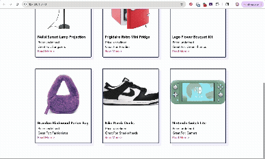

# Lab1-UnEarthedPart1
Week 1 Lab: UnEarthed, Part 1
# Web Development Lab 1 - *UnEarthed Part1*

Submitted by: **Kelly Chan**

This web app: **What should you get for someone who has everything (can't relate)? What about someone who hates stuff? Unearthed has your answer: it's a crowdsourced repo of great gift ideas for different kinds of people. Browse gifts by intended audience, price point, or category, or upload your own gift ideas!**

Time spent: **2.5** hours spent in total

## Required Features

The following **required** functionality is completed:

- [X] The web app uses only HTML, CSS, and JavaScript without a frontend framework.
- [X] The web app displays the title and logo of Unearthed.
- [X] The web app displays a list of gifts that have been submitted, including at least the name, price point, audience, and image.
- [X] The user can click on each item in the list to see a detail view of it, including all database fields.
- [X] The web app serves an appropriate 404 page when no matching route is defined.

The following **optional** features are implemented:

- [X] The web app is appropriately styled using Picocss

## Video Walkthrough

Here's a walkthrough of implemented required features:

GIF created with Adobe Express  

## License

    Copyright 2025 Kelly Chan

    Licensed under the Apache License, Version 2.0 (the "License");
    you may not use this file except in compliance with the License.
    You may obtain a copy of the License at

        http://www.apache.org/licenses/LICENSE-2.0

    Unless required by applicable law or agreed to in writing, software
    distributed under the License is distributed on an "AS IS" BASIS,
    WITHOUT WARRANTIES OR CONDITIONS OF ANY KIND, either express or implied.
    See the License for the specific language governing permissions and
    limitations under the License.

